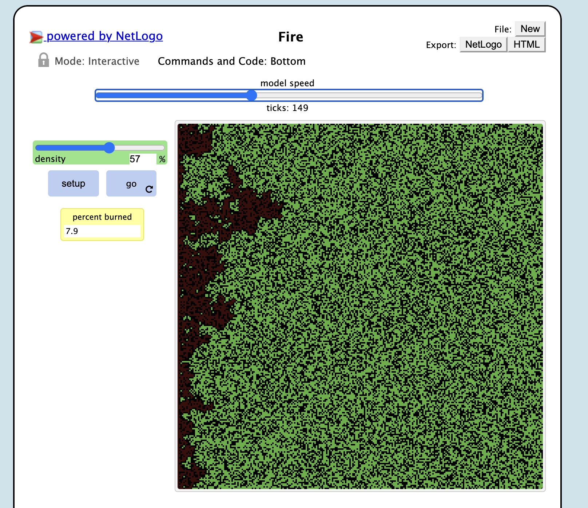
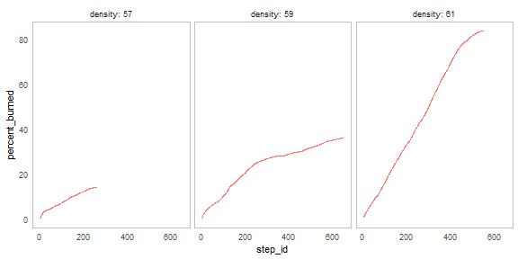
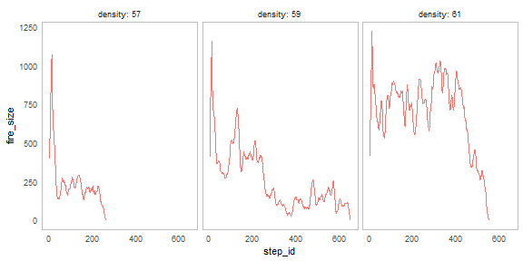
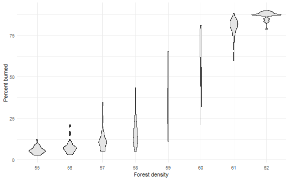
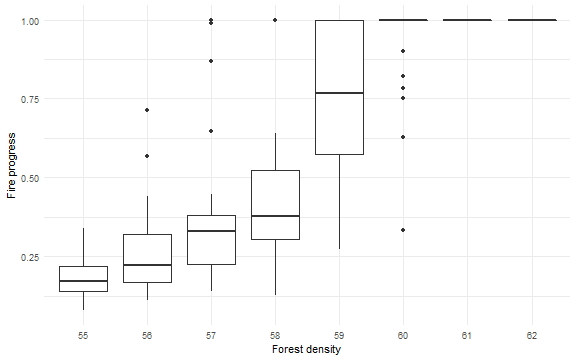
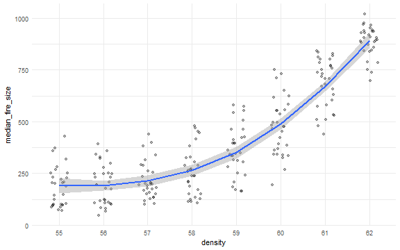
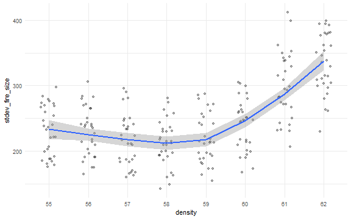
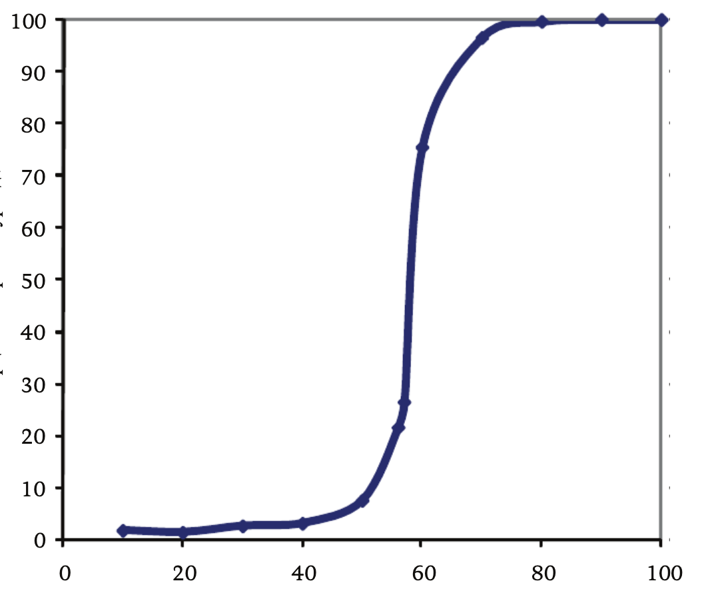

## Імітаційне моделювання комп'ютерних систем
## СПм-21-2, **Сергєєв Данило Андрійович**
### Лабораторная работа №**1**. Описание имитационных моделей

 

### Выбранная модель в среде NetLogo:
[Fire](http://www.netlogoweb.org/launch#http://www.netlogoweb.org/assets/modelslib/Sample%20Models/Earth%20Science/Fire.nlogo)

 

### Вербальное описание модели:
Fire - Этот проект имитирует распространение огня по лесу. Это показывает, что вероятность того, 
что огонь достигнет правого края леса, критически зависит от плотности деревьев. 
Это пример общего признака сложных систем, наличия нелинейного порога или критического параметра.

### Управляющие параметры:
- **density** регулирует плотность деревьев в лесу.

### Внутренние параметры:
- **not any? turtles** превращение черезапшки в костер или угли

### Критерии эффективности системы:
- Анализ примера общего признака сложных систем, наличия нелинейного порога или критического параметра.

### Примичания:
Ползунок ПЛОТНОСТЬ регулирует плотность деревьев в лесу. (Примечание: изменения ползунка DENSITY не вступят в силу до следующей

 

## Вычислительные эксперименты
 

 
### 1. Проведем несколько экспериментов для выяснения зависимости сгоревших деревьев от времени

 
Процент сгоревших деревьев в зависимости от времени
 
Можем наблюдать то, что при увелечение процента плонтости деревьев процент сгоревших деревьев в зависимости от времени сильно увеличивается 
 
 

 
Размер пожара как функция времени
 

 
Распределение конечного процента сгоревших деревьев при различных значениях плотности леса.
 

 
Распределение конечной огневой позиции при различных значениях густоты леса
 

 
Средний размер пожара. (Каждая точка представляет одну симуляцию.)
 

 
Стандартное отклонение размера пожара. Каждая точка представляет одну симуляцию.
 

 
Зависимость процента сожжених деревьев от густоты леса
